# Shop.io E-commerce Website
Shop.io is a full-fledged e-commerce website that enables users to register with their email and password, and also login using Google authentication. It allows users to reset their password if they forget it. Shop.io provides users with the option of making payments via cash on delivery or debit card using Stripe API. Users can browse, filter, and search for products by category, brand, and price. Admin users can add, delete, and update product information, view all orders, and change order statuses as per requirement 

### Features:
- Users can register with their email and password or use Google authentication to sign up or log in. The system also allows for password resetting if needed.

- Users can search for products by entering keywords in the search bar. They can filter products by category, brand, and price.

- Users can contact the website owner using the EmailJS library

- Users can place orders using cash on delivery or debit card payments through the Stripe API.

- Admin users have the ability to add, delete, and update products, as well as view all orders and change order statuses as needed.


## Tools/Libraries 


- React
- React Hooks
- Scss
- react-router-dom
- Redux
- Redux-toolkit
- firebase
- EmailJS
- Material UI
- local Storage

## Live Deployment   


 https://shopio.onrender.com/


## How to Use

- Create a Firebase project and add your Firebase configuration to a .env file in the root directory.

 - Create a Stripe account and add your Stripe    API keys to the .env file.

- Create an EmailJS account and add your EmailJS user ID to the .env file.

 - Install all dependencies

```bash
  npm install
```

- Start the locally frontend

```bash
  npm run start:frontend
```
- Start the locally backend
```bash
  npm run start:backend
```


## 🔗 Links
[](https://thesunnymallick.vercel.app/)

[](https://www.linkedin.com/in/thesunnymallick/)

[](https://www.instagram.com/themallicksunny/)

## Demo

### Home Page

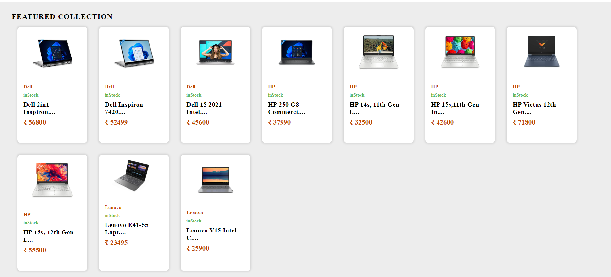
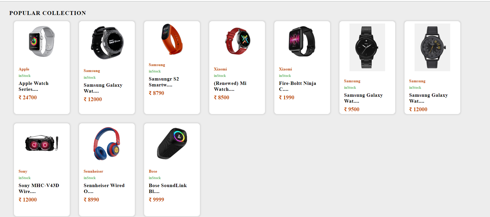
### Store Page
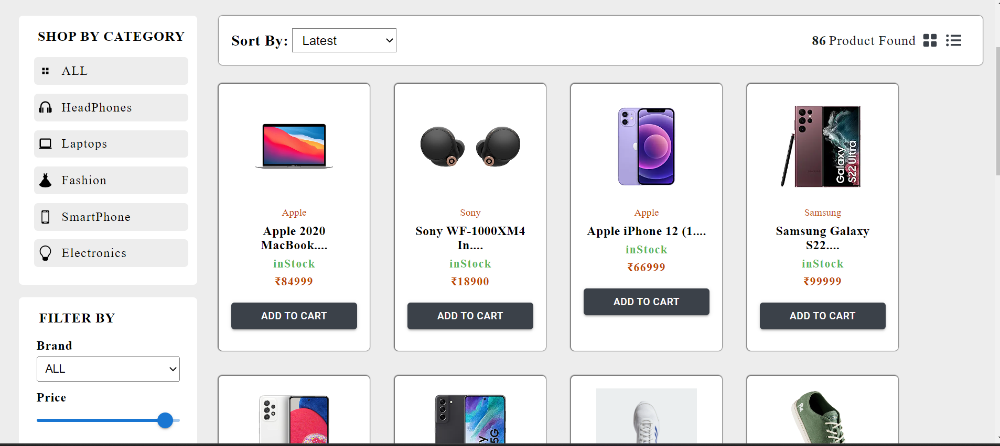
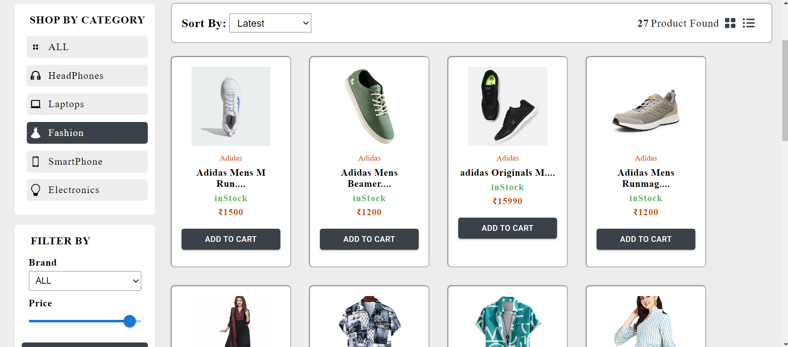

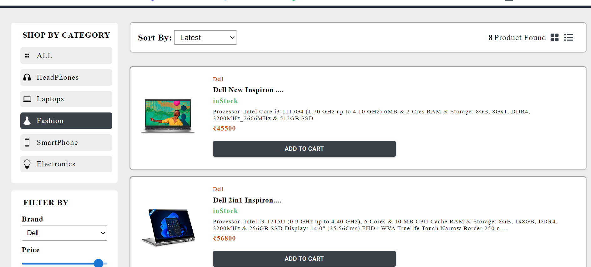
### product details
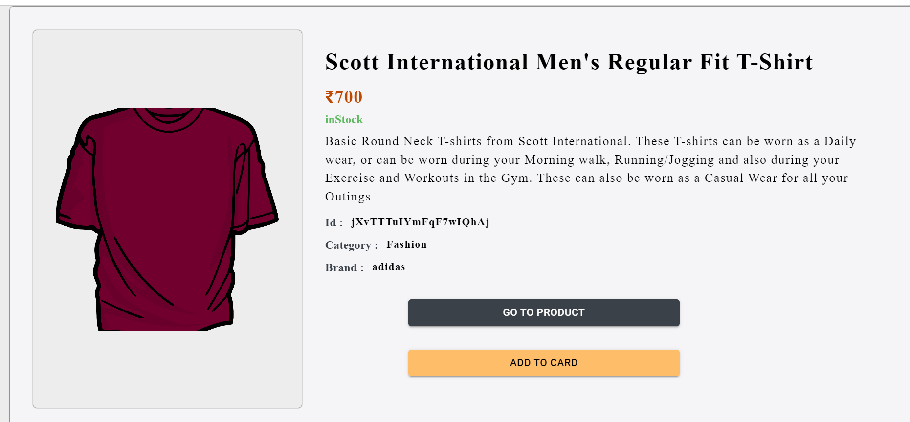

### Cart
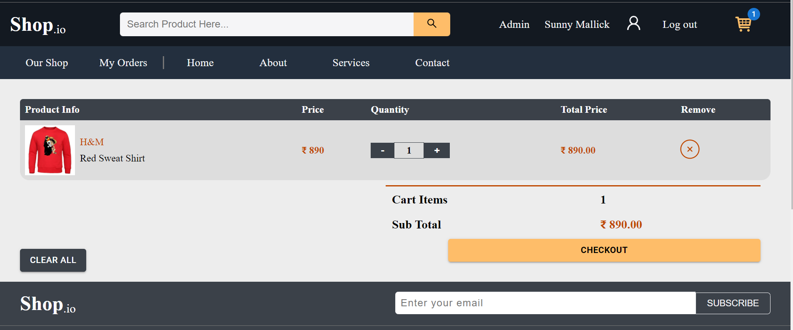


### Checkout
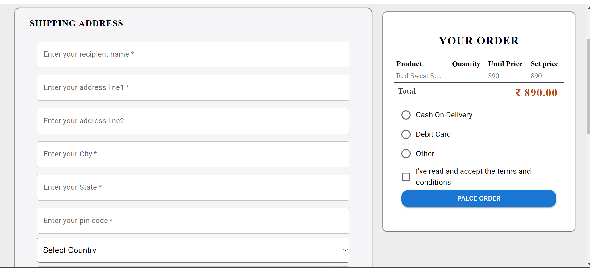
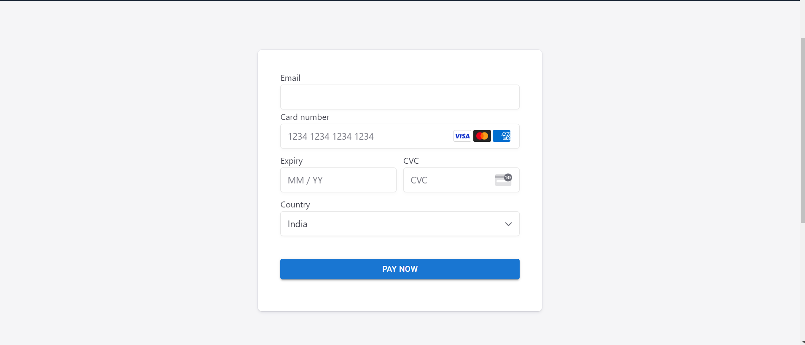

### Order history
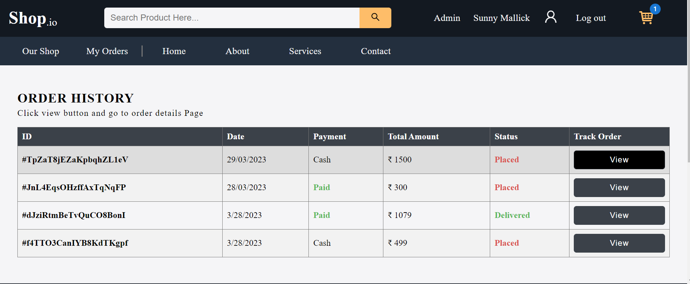
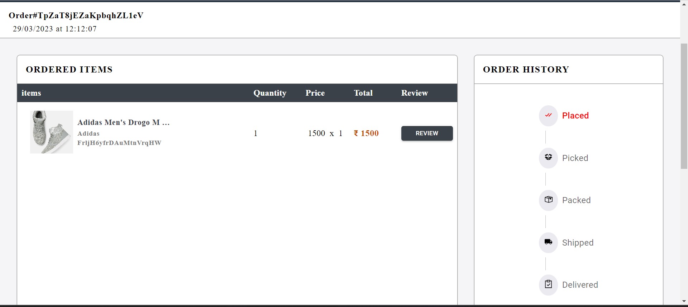

### Admin Dashboard

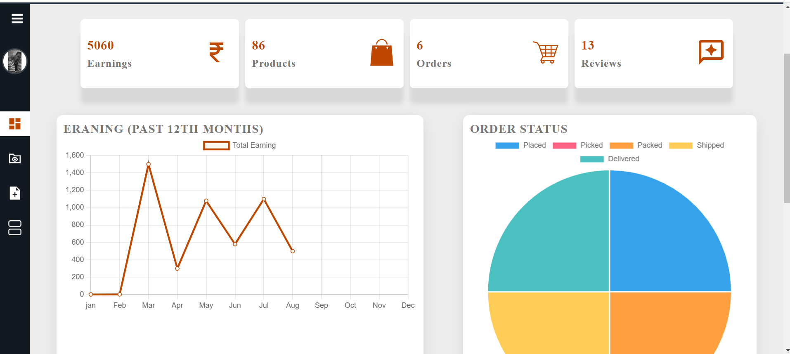
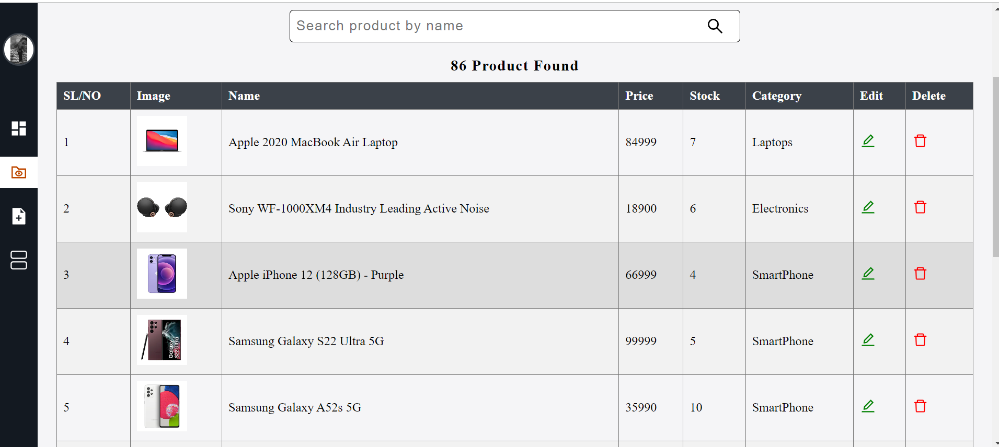
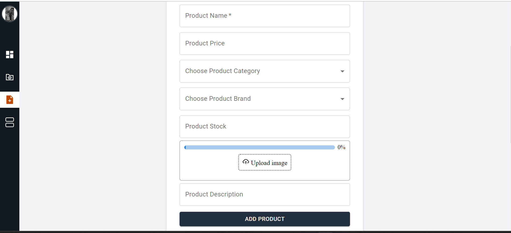
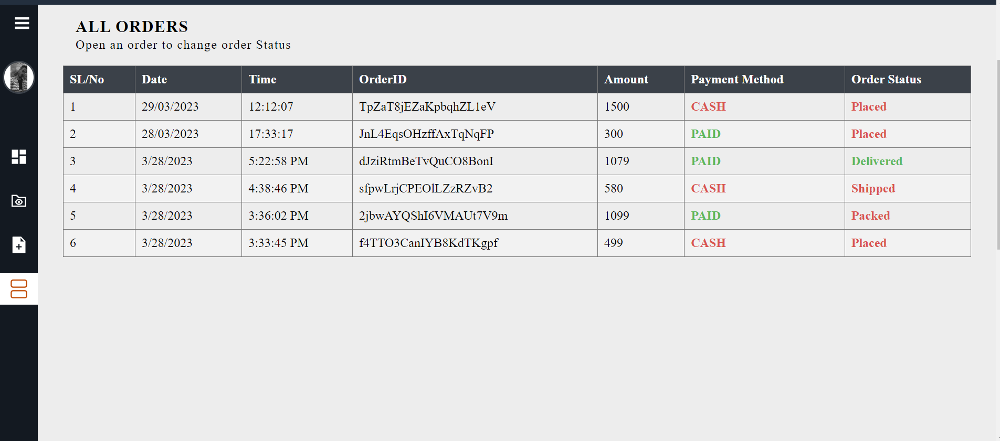

### login and register

<p>
    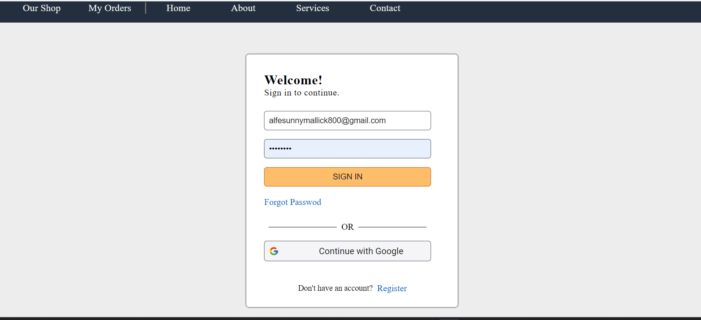
</p>

<p>
    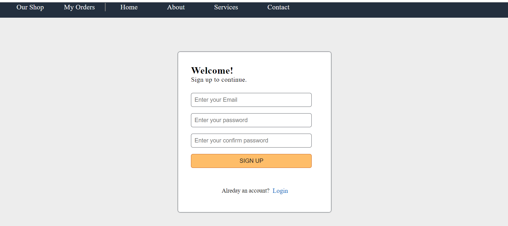
</p>
<p>
    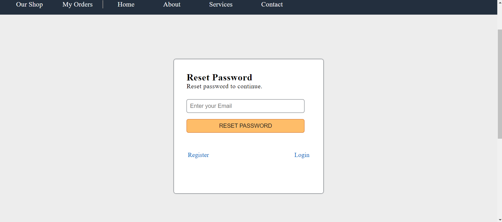
</p>


### contact us and about page

<p>
    
</p>
<p>
    
</p>


